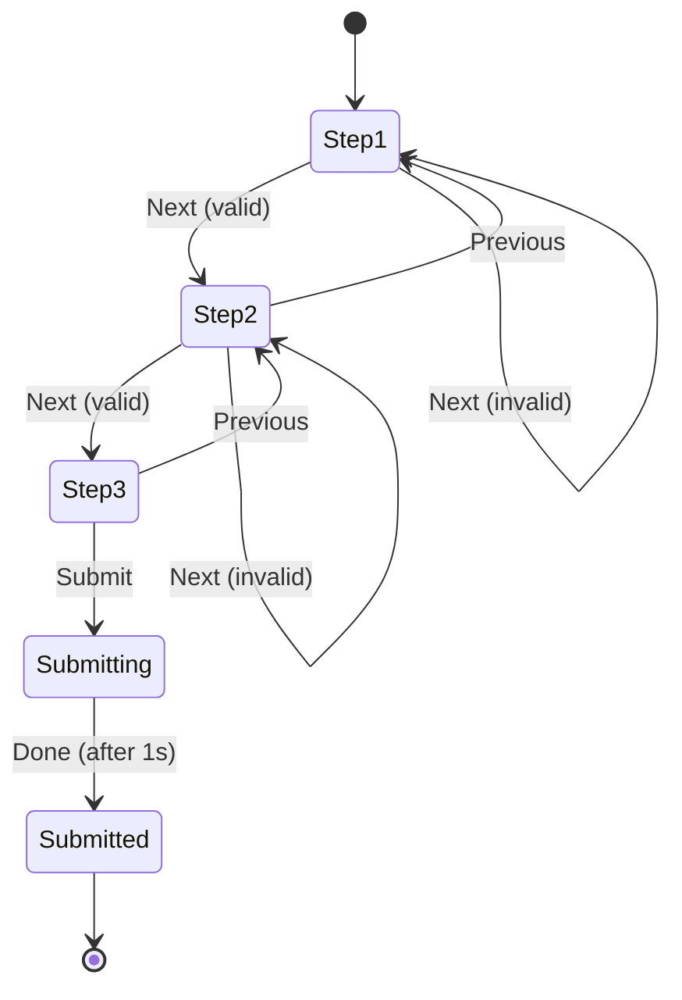

# Managing Form State

## 📚 Introduction

Complex forms require careful state management to handle **user input**, **validation**, and **navigation** between steps. Organizing related state is crucial.

### Instead of scattered state:

```typescript
// ❌ Hard to manage related state
const [currentStep, setCurrentStep] = useState(1);
const [formData, setFormData] = useState({});
const [errors, setErrors] = useState({});
const [isSubmitting, setIsSubmitting] = useState(false);
```

### Use unified form state:

```typescript
// ✅ Unified form state
const [form, setForm] = useState({
  step: 1,
  data: {},
  errors: {},
  status: 'editing' // or 'submitting', 'submitted'
});

// ❌ Might allow invalid progression
setForm({ ...form, step: form.step + 1 });

// ✅ Validate before updating
if (validateStep(form.step)) {
  setForm(f => ({ ...f, step: f.step + 1 }));
}
```

---

## 🎯 Exercise: Build a Form Wizard

### Task Description
Create a multi-step form with validation.

### Implementation

```typescript
function FormWizard() {
  const [form, setForm] = useState({
    step: 1,
    data: {
      personal: { name: '', email: '' },
      address: { street: '', city: '' },
      preferences: { notifications: false }
    },
    errors: {},
    status: 'editing'
  });

  function handleFieldChange(section, field, value) {
    setForm(form => ({
      ...form,
      data: {
        ...form.data,
        [section]: {
          ...form.data[section],
          [field]: value
        }
      }
    }));
  }
}
```

### 🤔 Consider

- **How do you keep related state synchronized?**
- **What happens when validation depends on multiple fields?**
- **How do you handle complex nested updates?**

### 📊 Requirements: Create All 3 State Visualizations

Before implementing, you must design your form wizard's state flow using **ALL THREE** approaches:

#### 1. Raw Text Diagram
FORM WIZARD STATE FLOW

Initial State:
- step: 1 (Personal Info)
- status: 'editing'
- data:
    - personal: { name: '', email: '' }
    - address: { street: '', city: '' }
    - preferences: { notifications: false }
- errors: {}

=== Step 1: Personal Info ===
Fields: name, email
Transition:
- "Next" clicked:
    - Validate:
        - name: required
        - email: required & valid format
    - If valid:
        - step → 2
        - errors cleared
    - If invalid:
        - stay on step 1
        - set errors.personal
- "Previous" button is hidden (no action)

=== Step 2: Address ===
Fields: street, city
Transition:
- "Next" clicked:
    - Validate:
        - street: required
        - city: required
    - If valid:
        - step → 3
        - errors cleared
    - If invalid:
        - stay on step 2
        - set errors.address
- "Previous" clicked:
    - Always allowed
    - step → 1

=== Step 3: Preferences ===
Fields: notifications (checkbox)
Transition:
- "Submit" clicked:
    - No validation needed
    - status → 'submitting'
    - Simulate submission (1s delay)
        - status → 'submitted'
- "Previous" clicked:
    - Always allowed
    - step → 2

=== Final State: ===
- status: 'submitted'
- Could reset to step=1 if needed (form reset flow)

=== Other rules ===
- Form data is always preserved across steps.
- Field error clears onChange.
- Progress bar updates per step.
- "Submit" button disabled if status = 'submitting'


#### 2. Mermaid Diagram
Create a professional state diagram using Mermaid syntax:


#### 3. Stately (XState) Design
Use [Stately.ai](https://stately.ai) to create a visual state machine for your form wizard, then screenshot/export your design and include it in your submission.
import { createMachine } from 'xstate';

const formWizardMachine = createMachine({
  id: 'formWizard',
  initial: 'editing',
  context: {
    data: {
      personal: { name: '', email: '' },
      address: { street: '', city: '' },
      preferences: { notifications: false },
    },
    errors: {},
  },
  states: {
    editing: {
      initial: 'step1',
      states: {
        step1: {
          on: {
            NEXT: [
              {
                cond: 'validateStep1',
                target: 'step2',
                actions: 'clearErrors'
              },
              { actions: 'setStep1Errors' }
            ],
            FIELD_CHANGE: { actions: 'updateField' }
          }
        },
        step2: {
          on: {
            NEXT: [
              {
                cond: 'validateStep2',
                target: 'step3',
                actions: 'clearErrors'
              },
              { actions: 'setStep2Errors' }
            ],
            PREVIOUS: 'step1',
            FIELD_CHANGE: { actions: 'updateField' }
          }
        },
        step3: {
          on: {
            SUBMIT: '#formWizard.submitting',
            PREVIOUS: 'step2',
            FIELD_CHANGE: { actions: 'updateField' }
          }
        }
      }
    },
    submitting: {
      invoke: {
        src: 'submitForm',
        onDone: { target: 'submitted' }
      }
    },
    submitted: {
      type: 'final'
    }
  }
}, {
  actions: {
    clearErrors: (context, event) => { console.log('Clear errors') },
    setStep1Errors: (context, event) => { console.log('Set Step 1 Errors') },
    setStep2Errors: (context, event) => { console.log('Set Step 2 Errors') },
    updateField: (context, event) => {
      const { section, field, value } = event;
      context.data[section][field] = value;
    }
  },
  services: {
    submitForm: () => new Promise((resolve) => setTimeout(resolve, 1000))
  },
  guards: {
    validateStep1: (context) => {
      const { name, email } = context.data.personal;
      const isNameValid = name.trim() !== '';
      const isEmailValid = /\S+@\S+\.\S+/.test(email);
      return isNameValid && isEmailValid;
    },
    validateStep2: (context) => {
      const { street, city } = context.data.address;
      return street.trim() !== '' && city.trim() !== '';
    }
  }
});

### 💡 Key Principle
> Group related state together to maintain consistency and simplify updates across your form's lifecycle.
