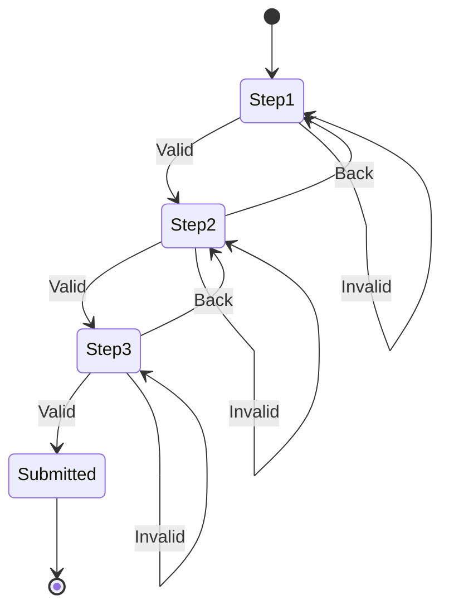

# Managing Form State

## 📚 Introduction

Complex forms require careful state management to handle **user input**, **validation**, and **navigation** between steps. Organizing related state is crucial.

### Instead of scattered state:

```typescript
// ❌ Hard to manage related state
const [currentStep, setCurrentStep] = useState(1);
const [formData, setFormData] = useState({});
const [errors, setErrors] = useState({});
const [isSubmitting, setIsSubmitting] = useState(false);
```

### Use unified form state:

```typescript
// ✅ Unified form state
const [form, setForm] = useState({
  step: 1,
  data: {},
  errors: {},
  status: 'editing' // or 'submitting', 'submitted'
});

// ❌ Might allow invalid progression
setForm({ ...form, step: form.step + 1 });

// ✅ Validate before updating
if (validateStep(form.step)) {
  setForm(f => ({ ...f, step: f.step + 1 }));
}
```

---

## 🎯 Exercise: Build a Form Wizard

### Task Description
Create a multi-step form with validation.

### Implementation

```typescript
function FormWizard() {
  const [form, setForm] = useState({
    step: 1,
    data: {
      personal: { name: '', email: '' },
      address: { street: '', city: '' },
      preferences: { notifications: false }
    },
    errors: {},
    status: 'editing'
  });

  function handleFieldChange(section, field, value) {
    setForm(form => ({
      ...form,
      data: {
        ...form.data,
        [section]: {
          ...form.data[section],
          [field]: value
        }
      }
    }));
  }
}
```

### 🤔 Consider

- **How do you keep related state synchronized?**
- **What happens when validation depends on multiple fields?**
- **How do you handle complex nested updates?**

### 📊 Requirements: Create All 3 State Visualizations

Before implementing, you must design your form wizard's state flow using **ALL THREE** approaches:

#### 1. Raw Text Diagram
Create a detailed text-based description of all states, transitions, and business logic:

```
FORM WIZARD STATE FLOW

Initial State:
- step: 1 (Personal Info)
- status: 'editing'
- data: empty objects for personal, address, preferences
- errors: empty object

State Transitions:

1. STEP 1 → STEP 2 (Personal Info → Address)
   Trigger: User clicks "Next" button
   Conditions: 
   - Name is not empty (minimum 2 characters)
   - Email contains "@" symbol and valid format
   - No validation errors present
   Action: Increment step to 2, clear previous errors
   
   STEP 1 → STEP 1 (Stay on Personal Info)
   Trigger: User clicks "Next" with invalid data
   Conditions: Name empty OR email invalid
   Action: Set errors object with specific field messages, keep step at 1

2. STEP 2 → STEP 3 (Address → Preferences)
   Trigger: User clicks "Next" button
   Conditions:
   - Street address is not empty
   - City is not empty
   Action: Increment step to 3, clear previous errors

   STEP 2 → STEP 1 (Back to Personal Info)
   Trigger: User clicks "Back" button
   Conditions: None (always allowed)
   Action: Decrement step to 1, preserve all form data

3. STEP 3 → SUBMITTED (Preferences → Final)
   Trigger: User clicks "Submit" button
   Conditions: All previous steps are valid
   Action: Change status to 'submitting', then 'submitted'

Error Handling:
- Each step validates only its own fields
- Errors are stored in errors object by field name
- Previous step data is always preserved
- User can navigate back without losing data

Final States:
- 'editing': User is actively filling the form
- 'submitting': Form is being processed (show loading)
- 'submitted': Form completed successfully
- 'error': Submission failed (allow retry)
```

#### 2. Mermaid Diagram
Create a professional state diagram using Mermaid syntax:


#### 3. Stately (XState) Design
Use [Stately.ai](https://stately.ai) to create a visual state machine for your form wizard, then screenshot/export your design and include it in your submission.

### 💡 Key Principle
> Group related state together to maintain consistency and simplify updates across your form's lifecycle.
